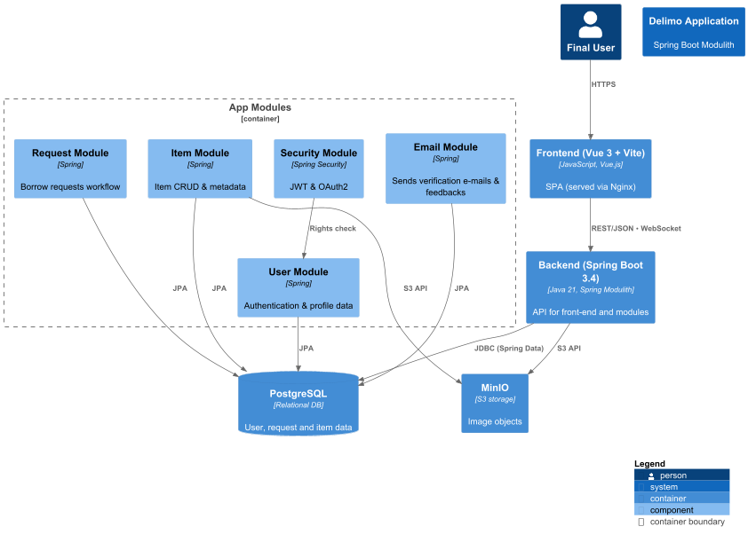

  

 

  <i><b>Delimo</b> is an application for sharing and exchanging items. Find someone to trade with in your city and give new life to things you no longer use!</i>
   
  Link app: <a href="https://delimo.rs">https://delimo.rs</a>
    
  <b><a href="https://delimo.rs">Website </a></b> | <b><a href="https://t.me/DelimoApp">Public Channel</a></b> | <b><a href="https://t.me/DelimoApp">Chat</a></b>
    
  
  
  
    

## Content
- [About](#about-delimo)
- [Architecture](#architecture)
- [Technologies](#technologies)
- [Features](#features)
- [How It Works](#how-it-works)
- [Getting Started](#getting-started)
- [How to Contribute](#how-to-contribute)

## About Delimo

  Delimo is a platform created to connect people who want to "borrow" an item for short-term personal use with those willing to lend those items either for free or for a small fee.

  Our project offers an alternative to traditional purchasing, focusing on sharing items. This is especially useful for things that are only needed for a short time. This approach encourages conscious consumption, extends the life cycle of items, and helps reduce the number of unnecessary objects that might otherwise end up in landfills.

  Delimo's mission is to support ecological balance and mindful use of natural resources. We believe that sharing instead of hoarding is a vital step toward a responsible relationship with the environment.

  Delimo is a non-profit initiative aimed at creating a practical and accessible platform for short-term use of items. Posting on the website is free, highlighting our commitment to socially responsible consumption and equal access to resources for all users.

  <b>Join Delimo and share consciously!</b>

## Architecture

## Technologies

The backend of Delimo is built with <b>Java 21</b> using <b>Spring Boot 3</b> and follows the <b>Spring Modulith</b> architecture. 
It includes modular components for authentication, user profiles, item management, request handling, and email communication. 
The application uses <b>Spring Security</b> with <b>JWT</b> and <b>OAuth2</b> for secure access control.

Data is stored in a <b>PostgreSQL</b> relational database, while item images are stored in <b>MinIO</b> using the <b>S3 API</b>. 
The frontend is developed with <b>Vue 3</b> and <b>Vite</b>, providing a modern single-page application (SPA) served through Nginx. 
Communication between frontend and backend is handled via <b>REST/JSON</b> and WebSocket protocols.

## Features
- **Simple.** Quickly and easily create exchanges.
- **Local.** Find users in your region.
- **Free.** The app is completely free to use.
- **Safe.** Communicate and exchange with confidence.

## How It Works
1. Create an account and enter information about the items you'd like to share.
2. Browse items from other users in your area.
3. Enjoy your newly borrowed item!

## Getting Started
1. Visit our website: <a href="https://delimo.rs">link</a>.
2. Create your account.
3. Post listings for items you'd like to share.
4. Find or offer exchanges in your community.

## How to Contribute
- Fork the repository.
- Create your own development branch.
- Make changes and submit a Pull Request.
- Share your ideas and suggestions in our chat: [chat-link](https://t.me/DelimoApp).

